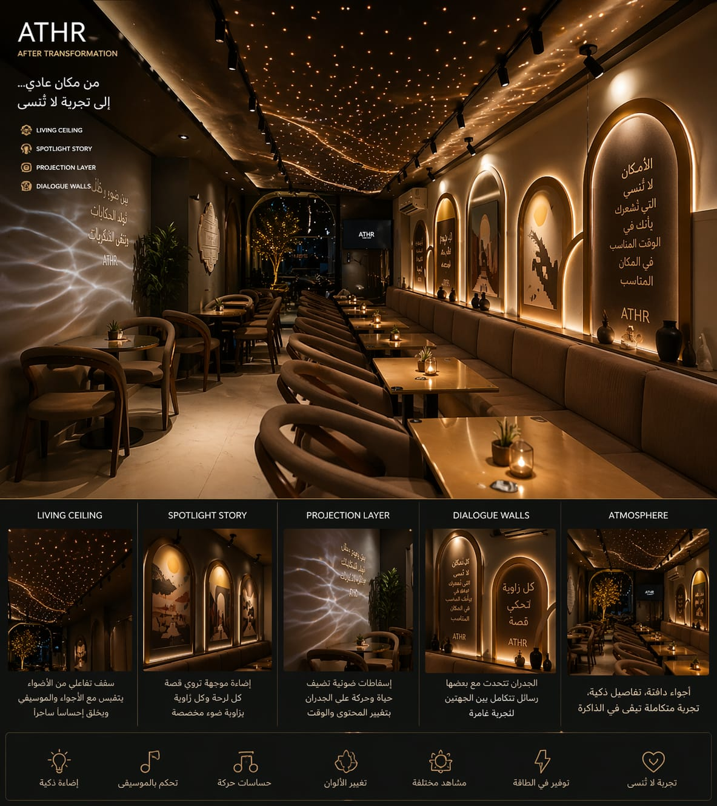
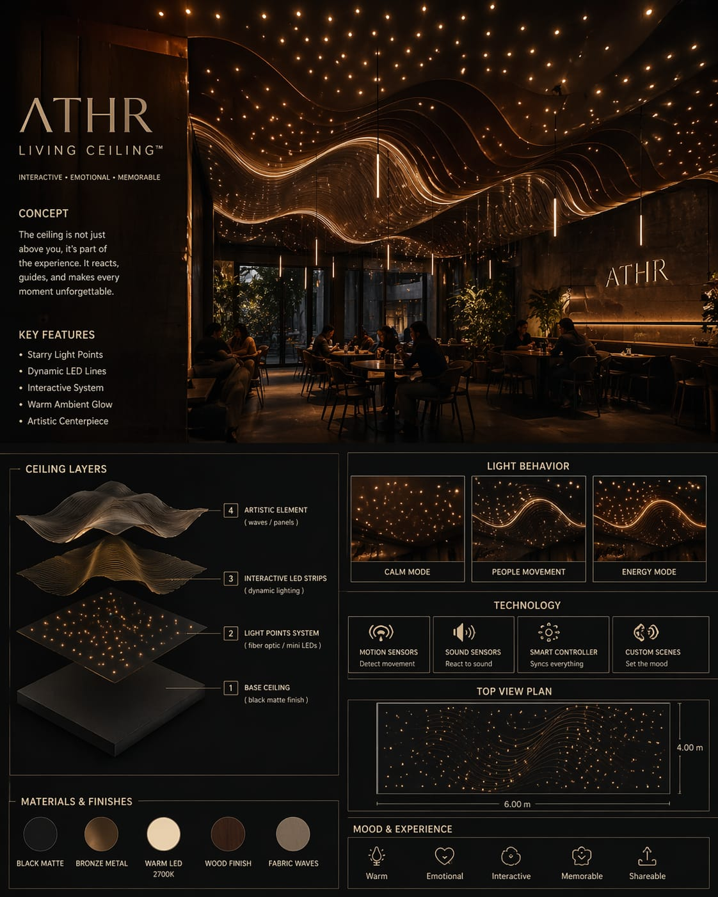
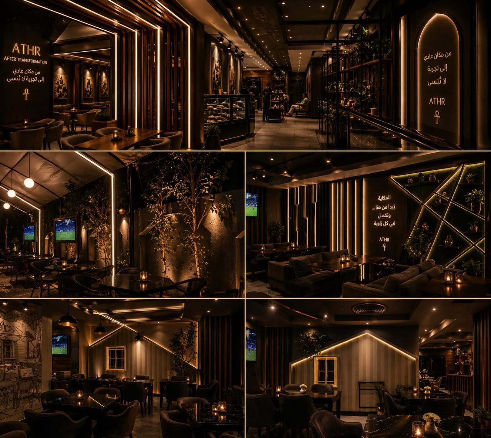

# Athr Studio — Origins / Creative Direction

**An early self-directed studio website retained as evidence of visual growth, design experimentation, and motion-led web direction.**

[Live website](https://athr-studio-website.vercel.app) · [Portfolio evidence](https://omar-khair-portfolio.vercel.app/work/athr)

  
  
  

## Why this repository is public

Athr is not positioned as a current flagship product. It is intentionally kept as **origins / progression evidence**: an earlier stage of self-directed web and visual work that helps show how later product and interface direction evolved.

## Evidence in the repository

- static web execution;
- visual-design studies;
- image-led layout work;
- video and motion material;
- early brand/studio direction.

## Structure

The project is a lightweight static website centered on `index.html`, with supporting `assets/`, `images/`, `videos/`, and design studies.

## Status

**Live creative origin / evolution project.**

The portfolio deliberately groups Athr under creative/origins rather than presenting it as current flagship engineering work.
